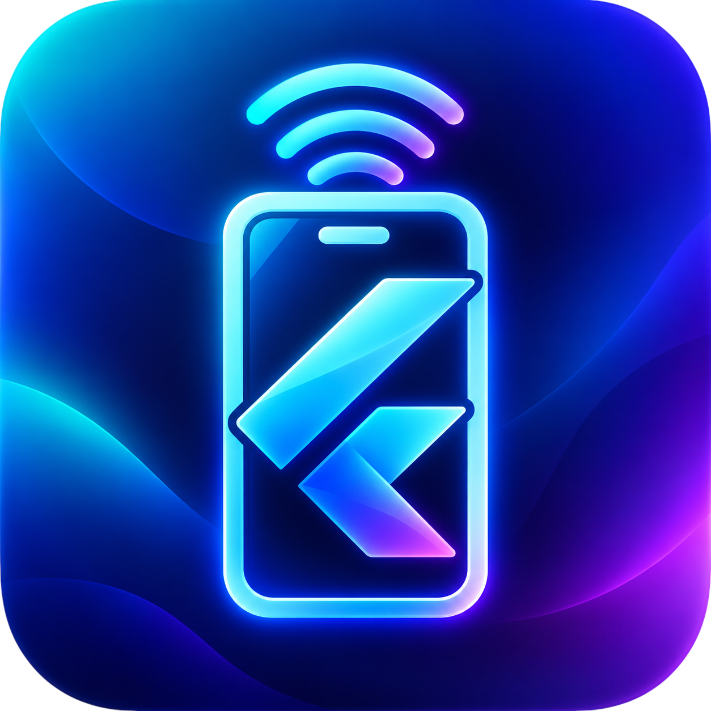
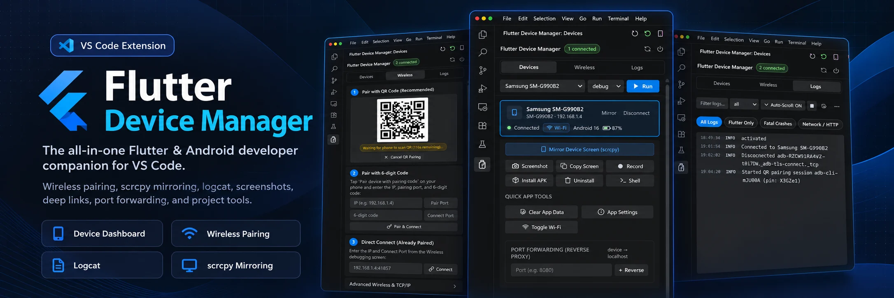

<p align="center">
  
</p>

<h1 align="center">Flutter Device Manager</h1>

<p align="center">
  <strong>The ultimate wireless ADB & Android device companion for Flutter developers inside Visual Studio Code.</strong>
</p>

<p align="center">
  <a href="https://marketplace.visualstudio.com/items?itemName=skrelectronicslab.flutter-device-manager">
    
  </a>
  <a href="https://marketplace.visualstudio.com/items?itemName=skrelectronicslab.flutter-device-manager">
    
  </a>
  <a href="LICENSE">
    
  </a>
  <a href="https://ko-fi.com/skrelectronicslab" target="_blank">
    
  </a>
</p>

<p align="center">
  
</p>

---

## ⚡ Overview

Say goodbye to tangled cables, disconnected terminals, and hunting for IP addresses. 

**Flutter Device Manager** turns VS Code into a comprehensive, native command center for your physical phones, emulators, and wireless devices. Pair wirelessly in seconds using QR codes, mirror screens with ultra-low latency via **scrcpy**, forward ports with **adb reverse**, filter real-time Logcat streams, and test deep links — all without leaving your editor.

---

## ✨ Key Features at a Glance

| Feature | Description |
|---|---|
| 📶 **QR & Wireless Pairing** | 1-scan QR code pairing (Android 11+) with real-time countdown or IP:Port pairing. |
| 🖥️ **Scrcpy Screen Mirroring** | 1-click low-latency, high-fps screen mirroring in a dedicated interactive window. |
| 🔄 **Port Forwarding (Reverse Proxy)** | Built-in `adb reverse` tool so mobile devices can access your `localhost` APIs. |
| 📋 **Logcat Viewer + Auto-Scroll** | Live log stream with smart auto-scroll and 1-click presets (Flutter, Crashes, Network). |
| 🔗 **Deep Link Dispatcher** | Trigger custom schemes (`myapp://path`) and universal links directly on device. |
| ⚡ **Auto-Reconnect History** | Remembers previously connected devices with 1-click **Auto-Connect All**. |
| 📸 **Screenshot to Clipboard** | Capture device screenshots directly into clipboard (`Ctrl+V`) and auto-save to disk. |
| 🛠️ **Flutter Dev Suite** | Run (Debug, Profile, Release), Hot Reload, Hot Restart, Pub Get, Clean, Doctor. |
| 🧹 **Smart Device Hygiene** | Automatically prunes stale duplicate sockets and isolates offline devices cleanly. |

---

## 🚀 Deep Dive

### 1. 📶 Wireless ADB & QR Pairing
* **Interactive QR Code (Android 11+)**: Displays a live QR code with an automatic 60-second validity countdown. Open **Wireless Debugging → Pair with QR code** on your Android device and scan the screen to pair instantly.
* **6-Digit Pairing Code**: Standard manual pairing with host, pairing port, and code.
* **Legacy TCP/IP (Android 10 & below)**: Switch connected USB devices to wireless mode (`adb tcpip 5555`) with a single click.
* **Device History**: Remembers your devices. Reconnect individually or hit **⚡ Auto-Connect All** to re-establish your entire multi-device workstation.

### 2. 🖥️ Scrcpy Screen Mirroring
* Launch low-latency, crystal-clear screen mirroring directly from the device card or toolbar.
* Control your mobile device using your computer's keyboard and mouse.
* Launches asynchronously without blocking VS Code or holding terminal processes hostage.

### 3. 🔄 Network Port Forwarding (`adb reverse`)
* Testing physical devices against a local backend (`http://localhost:8080`, `localhost:3000`, etc.) often fails because the mobile device is on a different network interface.
* Flutter Device Manager manages `adb reverse tcp:<port> tcp:<port>` with a friendly UI. Add, inspect, and remove active forwards in one click.

### 4. 📋 Live Logcat Stream with Presets & Auto-Scroll
* **Smart Auto-Scroll**: Streams the latest log lines automatically. Pauses intelligently when you scroll up to inspect a stack trace. Toggle auto-scroll with one click.
* **1-Click Quick Preset Filters**:
  * 🌐 **All Logs**: Full raw device stream.
  * 💙 **Flutter Only**: Isolates Flutter framework and engine output.
  * 💥 **Fatal Crashes**: Filters directly for `AndroidRuntime:E` exceptions and crash traces.
  * 📡 **Network / HTTP**: Isolates Dio, OkHttp, Retrofit, and HTTP request logs.
* Search by keyword, filter by level (Verbose, Debug, Info, Warn, Error), pause stream, copy, and export to `.txt`.

### 5. 🔗 Deep Link & Intent Dispatcher
* Test app deep linking without manually typing lengthy `adb shell am start` terminal commands:
  ```bash
  adb shell am start -a android.intent.action.VIEW -d "myapp://checkout?orderId=1024"
  ```
* Enter your custom URI or HTTPS link, select the target device, and dispatch directly to the screen.

### 6. 📱 Application Management & Toggles
* **Clear Data & Cache**: Instant `pm clear` to reset app state without uninstalling.
* **App Info & Permissions**: Jump straight to the phone's Application Info settings page.
* **Toggle Wi-Fi**: Test network disconnects and offline sync behavior instantly.
* **Install APK**: Pick any `.apk` from your file system with real-time install feedback.
* **Open ADB Shell**: Launches an interactive shell terminal focused on the target device.

---

## 🛠️ Requirements

1. **Android SDK Platform-Tools (`adb`)**:
   * Must be available in your system `PATH`, or configured via `flutterDeviceManager.adbPath`.
2. **Flutter SDK**:
   * Must be available in your system `PATH`, or configured via `flutterDeviceManager.flutterPath`.
3. *(Optional)* **scrcpy**:
   * For 1-click screen mirroring, install [scrcpy](https://github.com/Genymobile/scrcpy) (`winget install scrcpy`, `choco install scrcpy`, or `brew install scrcpy`).

---

## ⚙️ Extension Settings

| Setting | Default | Description |
|---|---|---|
| `flutterDeviceManager.adbPath` | `""` | Custom path to the `adb` executable (auto-detected if empty). |
| `flutterDeviceManager.flutterPath` | `""` | Custom path to the `flutter` executable (auto-detected if empty). |
| `flutterDeviceManager.autoRefreshMs` | `5000` | Device status poll interval in milliseconds. |
| `flutterDeviceManager.rememberLastDevice` | `true` | Restores last selected device upon reopening. |
| `flutterDeviceManager.autoReconnect` | `true` | Auto-reconnects saved wireless devices on startup. |
| `flutterDeviceManager.screenshotDir` | `""` | Folder to save screenshots (defaults to `~/Pictures`). |
| `flutterDeviceManager.recordingDir` | `""` | Folder to save screen recordings. |

---

## 💡 Support & Community

Flutter Device Manager is actively maintained by **SKR Electronics Lab**. If this tool saves you time, consider supporting future development:

<p align="left">
  <a href="https://ko-fi.com/skrelectronicslab" target="_blank">
    
  </a>
</p>

* **Author**: SK Raihan
* **Website**: [skrelectronicslab.com](https://skrelectronicslab.com)
* **YouTube**: [@skr_electronics_lab](https://youtube.com/@skr_electronics_lab)
* **Instagram**: [@skr_electronics_lab](https://instagram.com/skr_electronics_lab)
* **Twitter / X**: [@skrelectronics](https://twitter.com/skrelectronics)
* **Email**: [skrelectronicslab@gmail.com](mailto:skrelectronicslab@gmail.com)

---

## 📄 License

This extension is licensed under the [MIT License](LICENSE). Built with ❤️ for the Flutter & Android developer community.
